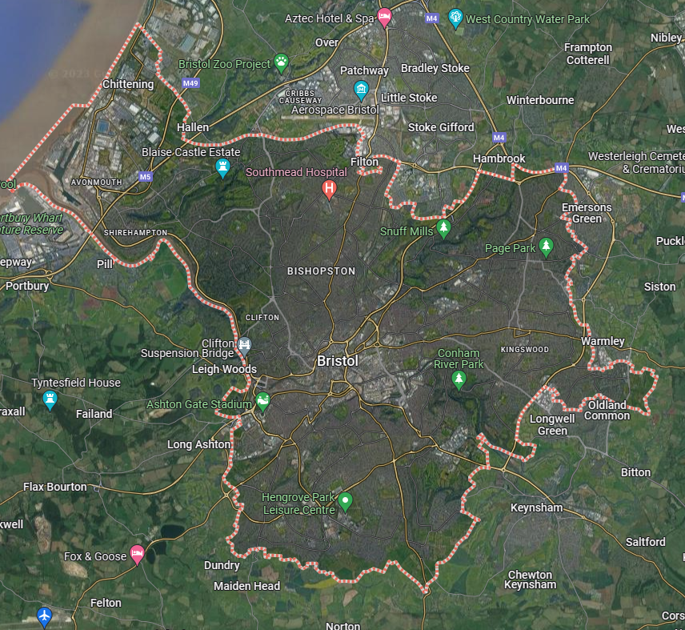

```{r setup, include=FALSE}
knitr::opts_chunk$set(echo = TRUE)
```

## 1 Introduction

### 1.1 Significance and Purpose of the Research

Analyzing a city's safety pattern is crucial for effective urban planning and law enforcement*(Tu, Chen, Wang, Yu, & Liu, 2022)*. It enables targeted crime prevention(*Ntakana, Mbanga, & Botha, 2022*) and emergency response strategies, helping allocate resources where they are most needed. Understanding safety patterns contributes to creating secure, resilient communities, attracting investment, and improving overall quality of life. This information is vital for evidence-based decision-making, fostering sustainable and inclusive urban environments.

Creating safe routes to school for students in urban areas is a critical issue with far-reaching implications for both individual well-being(*Ames, 2019*) and community health(*Bagan & Yamagata, 2015*). At its core, this initiative is about ensuring that children can travel to and from school in a secure and healthy environment. This is especially vital in cities, where traffic congestion, high-speed roads, and crime can pose significant risks to young pedestrians and cyclists.

Remote sensing technology has demonstrated its efficacy as a tool for monitoring surface conditions across various geographical scales, providing uninterrupted spatial coverage and diverse data resources. Night Light (NTL) observations measure the quantity of light emitted by the Earth's surface at nighttime. Contributions already made by nighttime lighting data (NTL) in analyzing urban growth*(Bagan & Yamagata, 2015)*, spatial connectivity*(Zhao, Li, Zhou, & Li, 2020)*, and urban categorization*(Zhao, Cheng, Wang, Wang, & Wang, 2020)*. However, research in urban safety remains sparse.

Therefore, this study takes Bristol as an example and creates safety factor of the city based on the city night light data. At the same time, it analyzes the safety around the colleges and dormitories of the University of Bristol and creates safe routes for students to go to school.

### 1.2 Research Content

Based on the theme of security, this research will accomplish the following main objectives:

1.  Create an urban safety factor for the city of Bristol based on night light data and analyze it spatially.
2.  Analyze the safety factors around the colleges and dormitories of the University of Bristol.
3.  Create safe routes between schools and dormitories through the shortest path method.

## 2 Method

### 2.1 Research Area

Bristol, a vibrant city in the southwest of England, holds a significant place in both historical and contemporary contexts. It is home to notable landmarks, thriving arts and music scenes, and prestigious universities, attracting a diverse population of students, professionals, and tourists. However, with its growing importance comes the need to address safety concerns that are inherent in any bustling urban environment.

The significance of focusing on safe routes to school for college students in Bristol cannot be overstated, especially considering the city's unique blend of historical architecture and modern urban development. Bristol, renowned for its vibrant culture and academic excellence, attracts a substantial number of college students to its various prestigious universities and colleges. These students, often living away from home for the first time, navigate the city's intricate network of streets and public transport systems daily. Ensuring their safe passage to and from educational institutions is crucial for multiple reasons (*Hamlin & Li, 2020; Burdick-Will, 2018*).



### 2.2 Data Acquisition

The data used in this study mainly contains: city night light data, city street data and spatial data of colleges and dormitories containing coordinates.

City night light data is available in Earth Observation Group (<https://eogdata.mines.edu/products/vnl/>). And street data, colleges and dorms data are available directly from Openstreet ([Planet OSM](https://planet.osm.org/)).

### 2.3 Data Preprocessing

As the acquired night light data is global, it needs to be cropped according to Bristol's administrative boundaries.This study uses python code to perform the cropping process.

```{python}
import geopandas as gpd
import rasterio
from rasterio.mask import mask

# Load Bristol administrative boundary shapefile
bristol_boundary_path = "E:/RStudio/learning/data/Urban/Bristol mark/Bristol.shp"
bristol_boundary = gpd.read_file(bristol_boundary_path)

#bristol_boundary.crs = "EPSG:27700"  # Assuming OSGB36 / British National Grid

# Load global night light data
night_light_path = "E:/RStudio/learning/data/Urban/night light/2020.tif"
night_light_data = rasterio.open(night_light_path)

# Crop night light data to Bristol boundary
bristol_2020, bristol_transform = rasterio.mask.mask(
    night_light_data,
    bristol_boundary.geometry,
    crop=True,
    nodata=night_light_data.nodata,
)

# Update metadata for the cropped data
night_light_meta = night_light_data.meta
night_light_meta.update({
    "height": bristol_2020.shape[1],
    "width": bristol_2020.shape[2],
    "transform": bristol_transform,
})

# Save the cropped night light data
output_path = "E:/RStudio/learning/data/Urban/night light/bristol_2020.tif"
with rasterio.open(output_path, "w", **night_light_meta) as dst:
    dst.write(bristol_2020)  
print("Cropped night light data saved to:", output_path)

```
