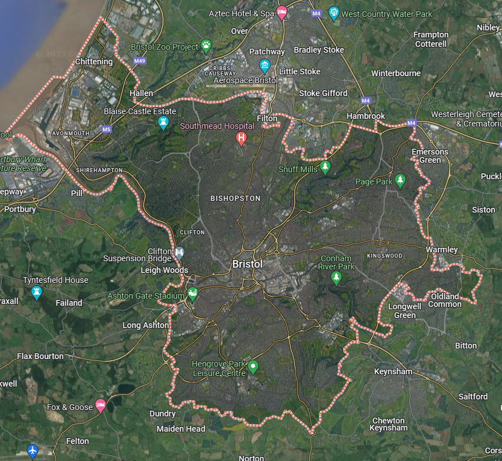
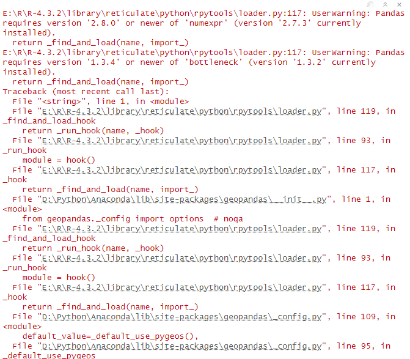

```{r setup, include=FALSE}
knitr::opts_chunk$set(echo = TRUE)
```

## 1 Introduction

### 1.1 Significance and Purpose of the Research

Analyzing a city's safety pattern is crucial for effective urban planning and law enforcement*(Tu, Chen, Wang, Yu, & Liu, 2022)*. It enables targeted crime prevention(*Ntakana, Mbanga, & Botha, 2022*) and emergency response strategies, helping allocate resources where they are most needed. Understanding safety patterns contributes to creating secure, resilient communities, attracting investment, and improving overall quality of life. This information is vital for evidence-based decision-making, fostering sustainable and inclusive urban environments.

Creating safe routes to school for students in urban areas is a critical issue with far-reaching implications for both individual well-being(*Ames, 2019*) and community health(*Bagan & Yamagata, 2015*). At its core, this initiative is about ensuring that children can travel to and from school in a secure and healthy environment. This is especially vital in cities, where traffic congestion, high-speed roads, and crime can pose significant risks to young pedestrians and cyclists.

Remote sensing technology has demonstrated its efficacy as a tool for monitoring surface conditions across various geographical scales, providing uninterrupted spatial coverage and diverse data resources. Night Light (NTL) observations measure the quantity of light emitted by the Earth's surface at nighttime. Contributions already made by nighttime lighting data (NTL) in analyzing urban growth*(Bagan & Yamagata, 2015)*, spatial connectivity*(Zhao, Li, Zhou, & Li, 2020)*, and urban categorization*(Zhao, Cheng, Wang, Wang, & Wang, 2020)*. However, research in urban safety remains sparse.

Therefore, this study takes Bristol as an example and creates safety factor of the city based on the city night light data. At the same time, it analyzes the safety around the colleges and dormitories of the University of Bristol and creates safe routes for students to go to school.

### 1.2 Research Content

Based on the theme of security, this research will accomplish the following main objectives:

1.  Create an urban safety factor for the city of Bristol based on night light data and analyze it spatially.
2.  Analyze the safety factors around the colleges and dormitories of the University of Bristol.
3.  Create safe routes between schools and dormitories through the shortest path method.

## 2 Method

### 2.1 Research Area

Bristol, a vibrant city in the southwest of England, holds a significant place in both historical and contemporary contexts. The significance of focusing on safe routes to school for college students in Bristol cannot be overstated, especially considering the city's unique blend of historical architecture and modern urban development. Bristol, renowned for its vibrant culture and academic excellence, attracts a substantial number of college students to its various prestigious universities and colleges. These students, often living away from home for the first time, navigate the city's intricate network of streets and public transport systems daily. Ensuring their safe passage to and from educational institutions is crucial for multiple reasons (*Hamlin & Li, 2020; Burdick-Will, 2018*).



### 2.2 Data Acquisition

The data used in this study mainly contains: city night light data, city street data and spatial data of colleges and dormitories containing coordinates.

City night light data is available in Earth Observation Group (<https://eogdata.mines.edu/products/vnl/>). And street data, colleges and dorms data are available directly from Openstreet ([Planet OSM](https://planet.osm.org/)).

### 2.3 Data Preprocessing

As the acquired night light data is global, it needs to be cropped according to Bristol's administrative boundaries.This study uses python code to perform the cropping process.



The above problem mainly tells about bugs originating from the pyproj package. I have found a solution, i.e. to recreate an environment to operate.The following points solved my problem:

1.  Create a total new conda environment:

conda config --prepend channels

conda-forge

conda config --set channel_priority strict

conda create -n pyproj_env pyproj

conda activate pyproj_env

2.  Create a new project using this new environment

3.  Install geopandas using conda

```{r echo=FALSE}
knitr::include_graphics("E:\\learning\\data\\Urban\\fig\\1.jpg")
```

```{r echo=FALSE}
knitr::include_graphics("E:\\learning\\data\\Urban\\fig\\2.jpg")
```

In addition, since the night lighting data is raster data and the network analysis input data needed for the study is vector data. Therefore, data conversion (raster to vector) is required. Meanwhile, remove the data where the light value is 0.

```{r include=FALSE}
#install.packages(c("raster", "sf"))
library(raster)
library(sf) 
```

```{r eval=FALSE, include=FALSE}
# Load Night Light Raster Data
night_light <- raster("E:/learning/data/Urban/night light/bristol_2020.tif")

# Convert raster to polygons
night_light_polygons <- rasterToPolygons(night_light, dissolve = TRUE)

# Convert SpatialPolygonsDataFrame to sf object
night_light_sf <- st_as_sf(night_light_polygons)

# Save the resulting vector data as a shapefile
st_write(night_light_sf, "E:/learning/data/Urban/night light/night_light_vector2.shp")
```

```{r include=FALSE}
# Load necessary packages
#install.packages("leaflet")
library(leaflet)
library(ggplot2)
library(dplyr)
```

```{r}
night_light_sf <- st_read("E:/learning/data/Urban/night light/night_light_vector.shp")
night_light_sf <- night_light_sf %>%
  filter(br_2020 != 0)
# Create a ggplot
ggplot() +
  geom_sf(data = night_light_sf, aes(fill = br_2020)) +
  scale_fill_gradient(low = "white", high = "yellow", na.value = "transparent") +
  labs(title = "Bristol Night Lights Vector Data",
       subtitle = "2020" ) +
  theme_minimal()

```

### 2.4 Safety Cost Distance Matrix

It is necessary to generate the spatial weight matrix based on the night light data and the given polygons. The thinking is: Areas with greater light intensity levels and shorter cost distances are more amenable to human activity*(Zhao, Li, Zhou, & Li, 2020)*. An infinity that symbolises no connectivity is used to show the lack of light pixels, or pixels that are entirely dark and signify the absence of human activity.

```{r include=FALSE}
library(tidyverse)
library(accessibility)
#library(kableExtra)
library(rprojroot)
library(osrm)
```

Extract the centers of mass in a polygon and use these as a proxy for calculating distances to specific points:

```{r include=FALSE}
#install.packages(c( "gdistance"))
library(spdep)
library(gdistance)
```

```{r}
# culculate center point (computing)
bristol.centre <- st_centroid(night_light_sf)

# Creating a Euclidean distance matrix
w <- as.matrix(dist(st_coordinates(bristol.centre)))

# Create a cost matrix to ensure there is no division by zero
night_light_values <- night_light_sf$br_2020
# If there is a value of 0, it can be replaced by a very small number such as 1e-6
night_light_values[night_light_values == 0] <- 1e-6
cost_matrix <- 1 / night_light_values

# Expand the cost matrix into a matrix with the same dimensions as the w-matrix
cost_matrix_expanded <- matrix(cost_matrix, nrow = nrow(w), ncol = ncol(w), byrow = TRUE)

# Calculate the cost distance matrix
cost_distance_matrix <- w * cost_matrix_expanded
```

This study created a cost distance matrix that takes into account both light intensity and actual physical distance. By using the reciprocal of the light values, less expenditure can be allocated to areas with higher light intensities, which is in line with the research objective of highlighting places that are more favorable for human activities.

```{r include=FALSE}
nearest_distances <- apply(cost_distance_matrix, 1, function(row) {
  # Excluding the case where the distance is 0 (the distance from the point to itself)
  min(row[row > 0])
})

# Add the distance value to the spatial data box
night_light_sf$nearest_cost_distance <- nearest_distances

```

```{r}
# plotting the map
ggplot(data = night_light_sf) +
  geom_sf(aes(fill = nearest_cost_distance)) +
  scale_fill_viridis_c() +  # Using the viridis color gradient
  theme_minimal() +
  labs(title="Safety Cost Distance Matrix",
       fill = "Cost Distance level")
```

```{r eval=FALSE, include=FALSE}
library(scales)
# Create a leaflet map object
pal <- colorNumeric(palette = "viridis", domain = night_light_sf$nearest_cost_distance, na.color = "transparent")

leaflet(night_light_sf) %>%
  addTiles() %>%  # Add default map tiles
  addPolygons(
    fillColor = ~pal(nearest_cost_distance),
    fillOpacity = 0.7,
    color = "#1a1a1a",  # Polygon Boundary Colors
    weight = 1  # Width of polygon boundary
  )

```

### 2.5 Create Safety Factor

Since safety is inversely proportional to cost distance (i.e., shorter, well-lit paths are considered safer), this study will define the safety factor based on the safety cost distance matrix. The idea is that the smaller the cost distance, the higher the safety level. Moreover, the cost distance value is normalized to a scale that represents the safety level.

```{r include=FALSE}
library(dplyr)
```

```{r echo=TRUE}
# Normalize the cost distance to create a safety factor (0 to 1, 1 being safest)
night_light_sf <- night_light_sf %>%
  mutate(safety_factor = (1 - (nearest_cost_distance - min(nearest_cost_distance, na.rm = TRUE)) / (max(nearest_cost_distance, na.rm = TRUE) - min(nearest_cost_distance, na.rm = TRUE))))
```

```{r}
# Use ggplot2 to plot the data
ggplot(data = night_light_sf) +
  geom_sf(aes(fill = safety_factor)) +
  scale_fill_gradientn(colours = rev(terrain.colors(100)), name = "Safety Factor")+  # Using the viridis color gradient
  theme_minimal() +
  labs(x = "Longitude", y = "Latitude", title = "Safety Factor Visualization")
```

### 2.6 Generation of Safe Paths

One of the purposes of this study is to examine the safety of comparing students' routes to schools. In this paper, University of Bristol and its students are selected as an example, and the addresses of the schools and each university's dormitories are chosen and the following steps are done:

1.  Filter the faces of the schools and dormitories and turn them into point data (doing this by selecting the center of mass).

For this step, the colleges were chosen to be represented by the School of Geographical Sciences, the School of Social Sciences and Law, the School of Social Medicine, the School of Chemistry and the School of Biological Sciences. The dormitories were chosen to be represented by HC (Harbor Court), OH (Orchard Heights), STS (St. Thomas Street), MH (Marlborough House), WC (Woodland Court), and PH (Printing Hall).

The choices here are based on diversity of spatial locations, i.e., trying to choose colleges and dormitories in as many different locations as possible. Meanwhile, colleges and dormitories that are too close to each other geographically are omitted.

```{r include=FALSE}
# Load the shapefile for schools
schools_sf <- st_read("E:learning/data/Urban/Bristol mark/schools.shp")

# Load the shapefile for dormitories
dorms_sf <- st_read("E:learning/data/Urban/Bristol mark/dorm.shp")

# Load the shapefile for roads
roads_sf <- st_read("E:learning/data/Urban/Britol street/gis_osm_roads_free_1.shp")
```

```{r include=FALSE}

# Convert schools to points if necessary

schools_sf <- st_centroid(schools_sf)


# Convert dormitories to points if necessary

dorms_sf <- st_centroid(dorms_sf)

```

Since the points after extracting the center of mass do not necessarily lie on top of the route, the point data needs to be moved to the nearest route.

```{r eval=FALSE, include=FALSE}
# Define the snap_to_road function
snap_to_road <- function(point, roads_sf) {
  # Check if the CRS matches
  if (!st_crs(point) == st_crs(roads_sf)) {
    stop("CRS mismatch between point and roads")
  }
  # Find the nearest road to the point
  nearest_road_index <- st_nearest_feature(point, roads_sf)
  nearest_road <- roads_sf[nearest_road_index, ]
  
  # Snap the point to the nearest road
  snapped_point <- st_nearest_points(point, nearest_road)
  
  # Return the snapped point (first point of the pair returned by st_nearest_points)
  return(snapped_point[1, ])
}

# Snap school centroids to the road network
schools_sf_snapped <- st_sf(
  geometry = lapply(st_geometry(schools_sf), snap_to_road, roads_sf = roads_sf)
)

# Snap dorm centroids to the road network
dorms_sf_snapped <- st_sf(
  geometry = lapply(st_geometry(dorms_sf), snap_to_road, roads_sf = roads_sf)
)

```

```{r}

# Calculate the bounding box that encompasses all schools and dormitories
all_points <- rbind(schools_sf, dorms_sf)
bbox <- st_bbox(all_points)

# Expand the bounding box slightly to add some padding around the points
padding <- 0.01  # adjust the padding value as needed
bbox_expanded <- bbox + c(-padding, -padding, padding, padding)


# Plot with adjusted limits and larger points
gg <- ggplot() +
  geom_sf(data = roads_sf, color = "gray") +
  geom_sf(data = schools_sf, aes(color = "Schools"), size = 5, shape = 21, fill = "blue") +
  geom_sf(data = dorms_sf, aes(color = "Dormitories"), size = 5, shape = 21, fill = "red") +
  scale_color_manual(values = c("Schools" = "blue", "Dormitories" = "red")) +
  coord_sf(xlim = c(bbox_expanded["xmin"], bbox_expanded["xmax"]), 
           ylim = c(bbox_expanded["ymin"], bbox_expanded["ymax"]), expand = FALSE) +
  theme_minimal() +
  labs(title = "Map of Schools and Dormitories with Roads", color = "Legend") +
  theme(legend.position = "bottom")

# Print the ggplot
print(gg)

```

2.  Calculate the shortest distance routes between each dormitory and each college using orsm package and visualize the safety factor of each route.

```{r eval=FALSE, include=FALSE}
# Check the CRS of each spatial object
crs_schools <- st_crs(schools_sf)
crs_dorms <- st_crs(dorms_sf)
crs_roads <- st_crs(roads_sf)
crs_night_light <- st_crs(night_light_sf)

# Print CRS for inspection
print(crs_schools)
print(crs_dorms)
print(crs_roads)
print(crs_night_light)
```

```{r eval=FALSE, include=FALSE}
# Make sure all objects have the same CRS, transforming if necessary
desired_crs <- st_crs(schools_sf)  # Choose the CRS you want to use for all operations
dorms_sf <- st_transform(dorms_sf, desired_crs)
roads_sf <- st_transform(roads_sf, desired_crs)
night_light_sf <- st_transform(night_light_sf, desired_crs)
```

```{r}
options(osrm.server = "https://router.project-osrm.org/")

# Initialize an sf object to store all routes
all_routes_list <- list()

# Loop over each school and dormitory to calculate routes
for (i in 1:nrow(schools_sf)) {
  for (j in 1:nrow(dorms_sf)) {
    # Calculate the route between the dormitory and school
    route <- osrmRoute(src = st_as_sf(dorms_sf[j,]), dst = st_as_sf(schools_sf[i,]), overview = "full")
    
    # Check if the route is valid and has geometry
    if (!is.null(route$geometry)) {
      # Convert the osrm route to an sf object
      route_sf <- st_as_sf(route$geometry)
      
      # Perform a spatial join to assign safety scores from 'night_light_sf' to the route
      route_sf <- st_join(route_sf, night_light_sf, left = FALSE, join = st_intersects)
      
      # Append the route_sf to the list
      all_routes_list[[length(all_routes_list) + 1]] <- route_sf
    }
  }
}

# Combine all route_sf objects into a single sf object
all_routes_sf <- do.call(rbind, all_routes_list)


```

```{r eval=FALSE, include=FALSE}
# Initialize a counter for the number of intersections
intersection_count <- 0

# Loop over the list of route_sf objects
for (route_sf in all_routes_list) {
  # Check for intersections between the route and the night light data
  intersection <- st_intersects(route_sf, night_light_sf, sparse = FALSE)
  
  # If there is at least one TRUE value in the intersection matrix, count it
  if (any(intersection, na.rm = TRUE)) {
    intersection_count <- intersection_count + 1
  }
}

# Print the number of intersections found
print(paste("Number of routes intersecting with night_light_sf:", intersection_count))
```

```{r}
# Filter out routes with safety factors below 0.9
filtered_routes_sf <- all_routes_sf %>% 
  filter(safety_factor >= 0.9)
# # Plot the route using ggplot2
ggplot() +
  geom_sf(data = roads_sf, color = "gray", size = 0.2) +  # Roads
  geom_sf(data = schools_sf, color = "blue", size = 3) +  # Schools
  geom_sf(data = dorms_sf, color = "red", size = 3) +     # Dorms
  geom_sf(data = filtered_routes_sf, aes(color = safety_factor), size = 10) +  # Filtered Routes
  scale_color_gradient(low = "blue", high = "green", name = "Safety Factor") +  # Custom color scale
  coord_sf(xlim = c(bbox_expanded["xmin"], bbox_expanded["xmax"]),
           ylim = c(bbox_expanded["ymin"], bbox_expanded["ymax"]), expand = FALSE) +
  theme_minimal() +
  labs(title = "Safest Route from Dorm to School", color = "Safety Factor")
```

```{r eval=FALSE, include=FALSE}
# Summarize NA counts by row and by column
na_count_by_school <- apply(safety_matrix, 1, function(x) sum(is.na(x)))
na_count_by_dorm <- apply(safety_matrix, 2, function(x) sum(is.na(x)))

# Create a data frame for easier viewing
na_summary <- data.frame(
  School = rownames(safety_matrix),
  NA_Count = na_count_by_school
)

na_summary_dorms <- data.frame(
  Dorm = colnames(safety_matrix),
  NA_Count = na_count_by_dorm
)

# Print the summaries
print(na_summary)
print(na_summary_dorms)

```

```{r include=FALSE}
library(tidyr)
```

## 3 Result

### 3.1 An analysis of urban safety in Bristol based on night light data

In order to clearly inform the safety factor of each area on the basis of visualization for rational analysis, the city's safety factor is visualized using leaflets. The safety factor of a block can be displayed by a left mouse click interaction.

The central area of Bristol is overlaid with a green color, which has a high safety factor of 0.91 to 0.97, indicating a high level of safety. This can occur as a result of an area having more well-lit streets, security guards patrolling the area more frequently, or more businesses in the area, which means that more security measures are usually in place in that area.

As one moves from the center to the periphery, there is a clear gradient from green to yellow, indicating a decreasing safety factor. The peripheral areas, especially the northwest and southeast, show an overlay of yellow and red, indicating a lower safety factor. In the northwest, the safety factor is in the range of 0.33 to 0.41, which may be due to factors such as less street lighting, less allocated safety resources, or more residents and fewer people around at night. Conversely, it is as low as 0.004 in the southeast, which is primarily likely because it approaches the limits of the administrative divisions, where there are less residents and less intense street lights.

The street map in the background provides context to the safety data by correlating it with the city's geography. Major roadways such as the A4 are easily observable, and it is evident that the regions surrounding these roads are generally safer, maybe as a result of the previously described considerations. In contrast, smaller streets and areas farther from main roads may be less safe due to lower visibility and fewer people around, especially at night.

```{r echo=TRUE}
#library(leaflet)
#library(RColorBrewer)
#library(sf)

# Create a color palette
safety_palette <- colorNumeric(palette = rev(terrain.colors(100)), domain = night_light_sf$safety_factor)

# Calculate mean longitude and latitude
coords <- st_coordinates(st_centroid(st_union(night_light_sf)))
mean_lng <- mean(coords[,1])
mean_lat <- mean(coords[,2])

leaflet(data = night_light_sf) %>%
  addProviderTiles(providers$OpenStreetMap) %>%
  addPolygons(fillColor = ~safety_palette(safety_factor),
              fillOpacity = 0.7, 
              color = "#BDBDC3", 
              weight = 1,
              popup = ~paste("Safety Factor:", safety_factor)) %>%
  addLegend("bottomright", 
            pal = safety_palette, 
            values = ~safety_factor, 
            title = "Safety Factor", 
            opacity = 1) %>%
  setView(lng = mean_lng, lat = mean_lat, zoom = 11) %>%
  addScaleBar(position = "bottomleft") %>%
  addMiniMap(toggleDisplay = TRUE)


```

### 3.2 Safety analysis around colleges and dormitories

In order to study the safety of the area around the colleges and dormitories, a new map was created that only visualizes the safety factor of the area containing the 2km radius around the schools and dormitories. Additionally, safety data is overlaid on real street data, and point data for dormitories and colleges are differentiated by red and blue colors. The safety factors can be interacted with by left mouse clicks, while the names of colleges and dormitories can be displayed by moving the mouse over the points.

From the information in the map, it can be seen that the colleges are mainly concentrated in the northwestern part of the catchment area, while the dormitories are mainly located in the southeastern part of the colleges. Overall, the security around the colleges is lower than that of the dormitories. Among them, the lowest safety factor is around the School of Social Medicine(SSM), with values ranging from 0.76 to 0.87, while the other four colleges are closer to each other, with safety factors ranging from 0.89 to 0.94. The safety factor around the dormitories is relatively high, with values of 0.95 or more around STS, HC, OH, and MH. While WC is located in the northwest, the safety coefficient around it is lower, which is between 0.87 and 0.89.

```{r echo=TRUE}
# Create a buffer around dorm locations (the distance for buffer should be chosen appropriately)
# Create the buffer around dorm locations
buffer_distance <- 2000 # Set this to the appropriate distance for your data
dorms_buffer <- st_buffer(dorms_sf, dist = buffer_distance)

# Find the indices of night_light_sf that intersect with dorms_buffer
indices <- st_intersects(night_light_sf, dorms_buffer, sparse = FALSE)

# Filter night_light_sf to only include rows with an intersection
night_light_dorms <- night_light_sf[indices, ]

# Create a color palette for the filtered data
safety_palette <- colorNumeric(palette = rev(terrain.colors(100)), domain = night_light_dorms$safety_factor)

leaflet() %>%
  addProviderTiles(providers$OpenStreetMap) %>%
  
  # Overlay the safety factor data only for areas with dorms
  addPolygons(data = night_light_dorms, fillColor = ~safety_palette(safety_factor),
              fillOpacity = 0.7, color = "#BDBDC3", weight = 1,
              popup = ~paste("Safety Factor:", safety_factor)) %>%
  
  # Add circles for schools
  addCircles(data = schools_sf, color = "blue", radius = 30, label = ~name, popupOptions = popupOptions(maxWidth = 300)) %>%
  
  # Add circles for dorms
  addCircles(data = dorms_sf, color = "red", radius = 30, label = ~name, popupOptions = popupOptions(maxWidth = 300)) %>%
  
  # Add a legend for the safety factor
  addLegend(pal = safety_palette, values = night_light_dorms$safety_factor, title = "Safety Factor", position = "bottomright")
```

### 3.3 Selection of the safe routes for the students

In order to make it safer for students to attend school, this study created safe paths. In order to show the safety factor between each college and dormitory more clearly, this study created a safety factor matrix by extracting the safety factor in the routes. Meanwhile, the results of the calculations are represented using leaflet and the values of the safety factor for all safe routes are represented interactively.

The safety factor matrix presents values for routes between various dormitories and university departments within Bristol. Higher values represent safer routes. The School of Chemistry, Biological Sciences, and Geographical Sciences South Block generally show high safety factors above 0.9, indicating relatively safe routes. The Department of Social Medicine exhibits a broader range of safety factors, with the route from Orchard Heights being the least safe at 0.885, and the route from Marlborough House showing a higher safety at 0.892. Overall, most routes appear to be quite safe, with the majority of the safety factors being close to or above 0.9.

As can be seen from the map, the routes from STS, PH, and MH have values as high as 0.96. The lowest safety factor occurs only on the short street West Park, which departs from WC to the west and connects very quickly to the main road, Whiteladies Road. The routes from Colleges all have safety factor of more than 0.94, which is relatively safe.

The safe routes twist and turn through the city, suggesting an attempt to stay within areas that have a higher safety factor. This may sometimes result in longer paths to ensure safety is prioritized over directness. Furthermore, it can be noticed that most of the safe routes are along the main roads of the city and close to the city center. As a result, the safe routes maintain a high level of safety.

```{r include=FALSE}
library(sf)
library(dplyr)
library(gdistance)
library(igraph)
library(leaflet)
library(sp)
library(RColorBrewer)
```

```{r include=FALSE}
options(osrm.server = "https://router.project-osrm.org/")

# Initialize a data frame to store all routes with their safety scores
all_paths <- data.frame(
  school_name = character(),
  dorm_name = character(),
  safety_factor = numeric(),
  stringsAsFactors = FALSE
)

# Loop over each school and dormitory to calculate routes
for (i in 1:nrow(schools_sf)) {
  school_name <- schools_sf$name[i]
  
  for (j in 1:nrow(dorms_sf)) {
    dorm_name <- dorms_sf$name[j]
    
    # Calculate the route between the dormitory and school
    route <- osrmRoute(src = st_as_sf(dorms_sf[j,]), dst = st_as_sf(schools_sf[i,]), overview = "full")
    
    # Check if the route is valid and has geometry
    if (!is.null(route$geometry)) {
      # Convert the osrm route to an sf object
      route_sf <- st_as_sf(route$geometry)
      
      # Perform a spatial join to assign safety scores from 'night_light_sf' to the route
      route_sf <- st_join(route_sf, night_light_sf, left = FALSE, join = st_intersects)
      
      # Calculate the average safety factor for the route
      if (nrow(route_sf) > 0 && "safety_factor" %in% names(route_sf)) {
        average_safety <- mean(route_sf$safety_factor, na.rm = TRUE)
      } else {
        average_safety <- NA  # Assign NA if there's no safety factor or no intersections
      }
      
      # Store the route information in the all_paths data frame
      all_paths <- rbind(all_paths, data.frame(
        school_name = school_name,
        dorm_name = dorm_name,
        safety_factor = average_safety
      ))
    }
  }
}

# Remove duplicate rows if any
all_paths <- all_paths %>% distinct()
```

```{r include=FALSE}
# Initialize the matrix with NA values
safety_matrix <- matrix(NA, 
                        nrow = length(unique(all_paths$school_name)), 
                        ncol = length(unique(all_paths$dorm_name)), 
                        dimnames = list(unique(all_paths$school_name), unique(all_paths$dorm_name)))

# Populate the matrix with safety factors
for (i in 1:nrow(all_paths)) {
  school_index <- match(all_paths$school_name[i], rownames(safety_matrix))
  dorm_index <- match(all_paths$dorm_name[i], colnames(safety_matrix))
  
  # If the matrix cell is not NA, it means there's already a value there, so we average it with the new one
  if (is.na(safety_matrix[school_index, dorm_index])) {
    safety_matrix[school_index, dorm_index] <- all_paths$safety_factor[i]
  } else {
    safety_matrix[school_index, dorm_index] <- mean(c(safety_matrix[school_index, dorm_index], all_paths$safety_factor[i]))
  }
}

# Now 'safety_matrix' contains the average safety factor for each school-dorm pair

```

```{r include=FALSE}
library(knitr)
library(kableExtra)
```

```{r echo=FALSE}

# Convert the safety matrix to a data frame for kable if it's not already
safety_matrix_df <- as.data.frame(safety_matrix)

# Create the table with kable and apply the styling
kable(safety_matrix_df, format = "html", align = 'c', escape = FALSE) %>%
  kable_styling(bootstrap_options = c("striped", "hover", "condensed", "responsive"), full_width = F) %>%
  row_spec(0, bold = TRUE) %>% # Make column names bold (header row)
  column_spec(1, bold = TRUE)  # Make row names bold (first column)

```

```{r echo=FALSE}
# Create a color palette
safety_palette <- colorNumeric(palette = "Blues", domain = filtered_routes_sf$safety_factor)

leaflet() %>%
  addProviderTiles(providers$OpenStreetMap) %>%
  addCircles(data = schools_sf, color = "blue", radius = 30, label = ~name, popupOptions = popupOptions(maxWidth = 300)) %>%
  addCircles(data = dorms_sf, color = "red", radius = 30, label = ~name, popupOptions = popupOptions(maxWidth = 300)) %>%
  addPolylines(data = filtered_routes_sf, color = ~safety_palette(safety_factor), weight = 5, 
               popup = ~paste("Safety Factor:", safety_factor)) %>%
  setView(lng = mean(c(bbox_expanded["xmin"], bbox_expanded["xmax"])), lat = mean(c(bbox_expanded["ymin"], bbox_expanded["ymax"])), zoom = 13) %>%
  addLegend("bottomright", pal = safety_palette, values = filtered_routes_sf$safety_factor, title = "Safety Factor")
```

## 4 Discussion

In this study, a safety factor for the city of Bristol was generated by creating a safety cost distance matrix based on the city's night lighting data. This safety factor not only takes into account the distance cost through Euclidean distance, but also utilizes the light intensity of the night light data as a safety cost consideration. In addition, this study analyzes the safety of the city of Bristol and the surrounding area of the colleges and halls of residence of the University of Bristol through this safety factor. What is more, safe routes were chosen for students to go to school. These will be of great help in the development of safety policies in the city, the construction of safety infrastructure around schools and the maintenance of safety for students going to and from school.

However, due to time and technical constraints, this study still has many shortcomings. Firstly, the safety factors in this study are mainly based on light intensity from night light data. However, safety in cities and schools should not only consider light intensity, but also urban crime rates, security infrastructure (e.g., surveillance, road accessibility, etc.), and the time of day. Second, due to data limitations, the student population in this study is primarily college students, rather than elementary and middle school students, who are more deserving of protection. Last but not least, The safe routes in this study were calculated using only the shortest path method from the osrm package. In order to make the safe routes more representative, the distance cost and safety cost (which can be achieved by taking the inverse of the safety factor) should be weighted to generate safe weighted distance routes.

Therefore, in future studies, the determination of the urban safety factor can be generated after determining the weights of the factors by means of geographically weighted regressions (considering factors such as street illumination, urban crime rates, safety infrastructure, and peak travel hours to and from school, among others). In the case of school safety, the main group will be focused on underage students who should be more protected, and reasonable safe routes for students will be developed by weighting the cost of safety and the cost of distance.

## 5 Conclusion

Based on the above results, the following conclusions were drawn from this study:

1.  The central area of Bristol is quite safe, with a high safety factor ranging from 0.91 to 0.97. This suggests that the central area is well-lit, has frequent security patrols, and benefits from the presence of businesses that likely contribute to a safer environment.

2.  There is a clear gradient in safety from the central area to the periphery. The central areas, being greener on the heatmap, indicate a higher safety factor, while the peripheral areas, particularly to the northwest and southeast, show a lower safety factor, denoted by yellow and red colors. The northwest has safety factors ranging from 0.33 to 0.41, while the southeast drops as low as 0.004, potentially due to reduced lighting and fewer people present at night.

3.  Safety appears to correlate with proximity to major roads, such as the A4, where the safety factor is higher. This could be due to better lighting, higher traffic volumes, and the associated increased visibility and surveillance.

4.  The safety around colleges, especially in the northwest, is lower than around dormitories. The lowest safety factors are around the School of Social Medicine (SSM), while dormitories like STS, HC, OH, and MH have higher safety factors above 0.95. This suggests that dormitories are located in safer zones compared to colleges.

5.  The study also established safe school routes in Bristol, showcasing high safety factors, particularly for the School of Chemistry and Biological Sciences. Interactive mapping and a detailed safety matrix reveal the safest paths prioritize security, mainly align with main roads and city center, ensuring reliable and secure student transit.

## Reference

*Tu, Y., Chen, Z., Wang, C., Yu, B., & Liu, B. (2022). Quantitative analysis of urban polycentric interaction using nighttime light data: a case study of shanghai, china. Ieee Journal of Selected Topics in Applied Earth Observations and Remote Sensing, 15. <https://doi.org/10.1109/JSTARS.2021.3137167>*

*Ntakana, K., Mbanga, S., & Botha, B. (2022). The significance of safety and security in urban public space design for sustainability. Journal of Public Administration, 57(2), 262–271. <https://doi.org/10.10520/ejc-jpad_v57_n2_a6>*

*Ames, B. (2019). Making schools safe for students. National Institute of Justice Journal, Number 281 (november 2019).*

*Bagan, & Yamagata. (2015). Analysis of urban growth and estimating population density using satellite images of nighttime lights and land-use and population data. Giscience & Remote Sensing, 52(6), 765–780. <https://doi.org/10.1080/15481603.2015.1072400>*

*Zhao, Z., Cheng, G., Wang, C., Wang, S., & Wang, H. (2020). City grade classification based on connectivity analysis by luojia i night-time light images in henan province, china. Remote Sensing, 12(11), 1705–1705. <https://doi.org/10.3390/rs12111705>*

*Hamlin, D., & Li, A. (2020). The relationship between parent volunteering in school and school safety in disadvantaged urban neighborhoods. Journal of School Violence, 19(3), 362–376.*

*Burdick-Will, J. (2018). Neighborhood violence, peer effects, and academic achievement in chicago. Sociology of Education, 91(3), 205–223.*

*Zhao, X., Li, X., Zhou, Y., & Li, D. (2020). Analyzing urban spatial connectivity using night light observations: a case study of three representative urban agglomerations in china. Ieee Journal of Selected Topics in Applied Earth Observations and Remote Sensing, 13. <https://doi.org/10.1109/JSTARS.2020.2980514>*

Word Count = 3764(Total)-241(reference) =3523(excluding code and reference)
